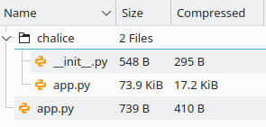
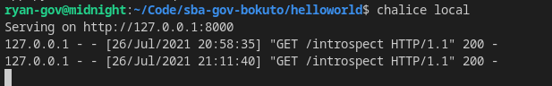
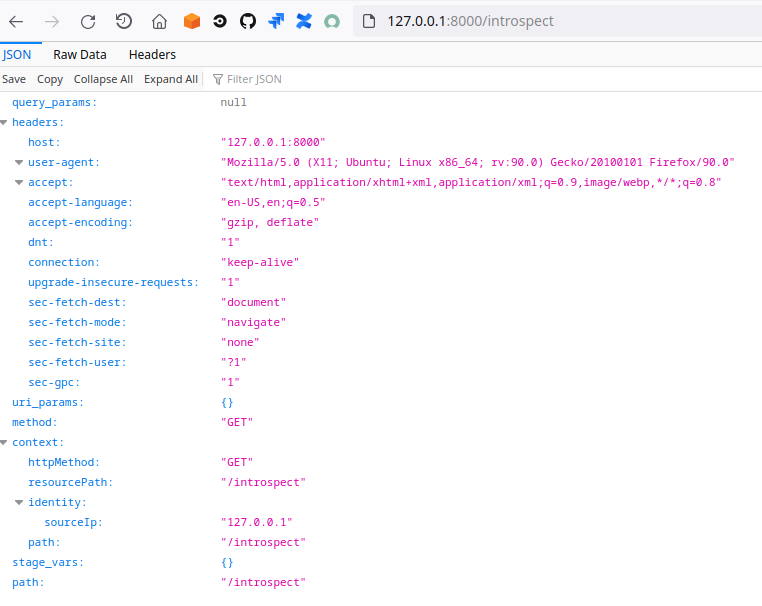
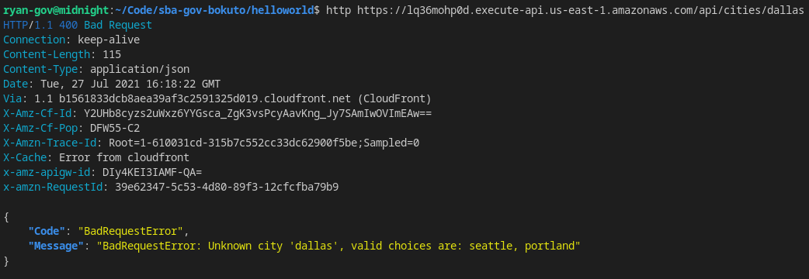
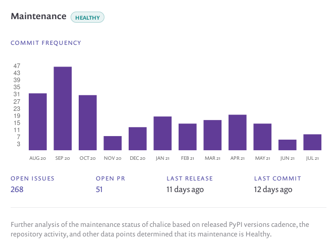

# Chalice

[AWS Chalice](https://aws.github.io/chalice/index.html) is a microframework for writing serverless applications using Python.

## Summary
This is leaner, purpose built [Flask-esque](https://flask.palletsprojects.com/en/2.0.x/) framework for using Python with serverless.

Chalice is an exciting microframework, because it fills a special niche between heavy tooling that tries to do everything (and thus provides a lot of magic you may not understand and may have to figure out once a feature you need is unsupported [e.g. Serverless Framework]) and no tool at all (which forces you to do everything manually).  It solves a lot of fundamental problems you encounter when working with serverless offerings from AWS:

- No local development environment for Lambda
- No easy way to see Lambda stack traces outside of CloudWatch Logs
- No way to define middleware per AWS service

With a little more [upfront strategic thought](https://alexkrupp.typepad.com/sensemaking/2021/06/django-for-startup-founders-a-better-software-architecture-for-saas-startups-and-consumer-apps.html) on how to use it, I would recommend we expand the pilot.  

## Questions
- How mature is AWS Chalice?
- Is it ready to be used in Production?
- How does it fit into our new S3 static website + API Gateway + Lambda strategy?

## Answers
In terms of maturity, Version 1.0 was released on July 31, 2017.  The project appears well maintained.  The maintainers track experimental features (APIs) by version number, and they provide upgrade notes for versions with major changes.

Yes, it is ready for a Production environment use case.

In terms of strategic fit, this could be a fewer dependency, easier to grok, uniform way of both writing serverless applications and deploying them.  The imperative coding style of Python, plus the larger standard library, are both huge boons in our dual quests to make our code easier to understand and to reduce our total size of codebase.

Finally, at 74kb unzipped (about the size of ReactJS when zipped), it really is a micro-framework:



## Bright Spots
Here are the better parts of Chalice:

### Local Development
Chalice provides a local Lambda environment that is fast and supports hot re-load:



This makes locally testing Lambda based API end points a charming experience:



As an aside, this route is awesome for testing and is pulled straight from their tutorial docs:
```python
@app.route('/introspect')
def introspect():
    return app.current_request.to_dict()
```

### Friendly Error Messages
Chalice defines a set of standard error messages, which greatly improves upon the basic Lambda 500 internal server error.  These are:
```python
* BadRequestError - return a status code of 400
* UnauthorizedError - return a status code of 401
* ForbiddenError - return a status code of 403
* NotFoundError - return a status code of 404
* ConflictError - return a status code of 409
* UnprocessableEntityError - return a status code of 422
* TooManyRequestsError - return a status code of 429
* ChaliceViewError - return a status code of 500
```

This makes common issues easy to handle:
```python
CITIES_TO_STATE = {
    'seattle': 'WA',
    'portland': 'OR',
}

@app.route('/cities/{city}')
def state_of_city(city):
    try:
        return {'state': CITIES_TO_STATE[city]}
    except KeyError:
        raise BadRequestError("Unknown city '%s', valid choices are: %s" % (
            city, ', '.join(CITIES_TO_STATE.keys())))
```

Here is an example of a BadRequestError:




### Middleware
You can register [middleware](https://aws.github.io/chalice/topics/middleware.html) per type of event handlers with options like S3, SNS, SQS, CloudWatch, which is a great idea.  Imagine being able to uniformly transform all of the messages being passed to and from an SNS topic?  This feels very powerful.

### Security
As of 07/28/21, Snyk Advisor gives Chalice a [score of 93 out of 100](https://snyk.io/advisor/python/chalice) for being popular, well maintained, and without security vulnerabilities.



## Head Scratchers
Here's a list of shortcomings from Chalice:

### Magical Resource Names
Chalice makes assumptions for you in order to perform its magic.  As an example, Lambda functions are automagically named after [a pattern of project_name+stage+handler_function](https://github.com/aws/chalice/issues/1368).  As another example, your API Gateway will always just get the name of the project.  For new accounts and less mature infrastructure, this matters less.  For older, more mature infrastructure with established naming conventions that provide predictability, this could be a source of confusion.

The trick is to be careful and thoughtful when generating a new project using ```chalice new-project <name>```

My finding is that you can modify the Lambda and IAM role resource names by changing the "app_name" in the /.chalice/config.json file, but you seemingly cannot change the API Gateway resource name away from the original ```<name>``` provided when running the new-project command.  If you want to re-name the directory for organizational purposes, then it makes sense to run ```chalice new-project <name>``` with whatever name you want your resources to receive in AWS, and then afterwards, rename the directory.  

This is super hacky, but it works.

### Terraform Support
Chalice does support exporting to Terraform, but even after a short while using ```chalice deploy``` you probably will start to wonder: why use Terraform at all?  The ergonomics of ```chalice deploy``` are nothing short of fantastic.  Still, the auto-generated Terraform code is not terrible.

Here's an example Lambda resource that was auto-generated by Chalice:
```hcl
"aws_lambda_function": {
    "api_handler": {
    "function_name": "test-tf-deploy-dev",
    "runtime": "python3.8",
    "handler": "app.app",
    "memory_size": 128,
    "tags": {
        "aws-chalice": "version=1.24.0:stage=dev:app=test-tf-deploy"
    },
    "timeout": 60,
    "source_code_hash": "${filebase64sha256(\"${path.module}/deployment.zip\")}",
    "filename": "${path.module}/deployment.zip",
    "role": "${aws_iam_role.default-role.arn}"
    }
},
```