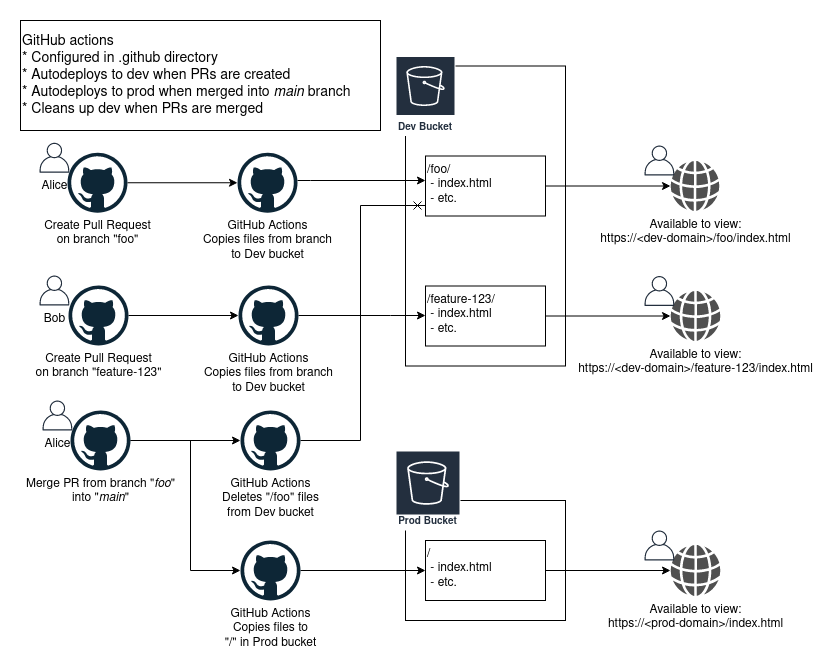

# Reference Architecture: Static site with S3 and CloudFront

## Features

* Simple hosting for static/generated websites
* A separate test deployment to dev for every PR
* Automatic deployment to production when merged to main branch

### Deployment Process



## Initial Setup

### Terraform

The infrastructure is intended to be deployed twice.  Once for dev, and once for prod.  This can
be accomplished in a number of ways with terraform.  Copying the directory; copying the resources;
creating a subdirectory/local-module; using workspaces; etc.

The following is how to deploy the initial configuration.

* Install Terraform CLI
* Configure AWS cli credentials
* Configure `main.tf`'s `locals` block to your desried settings
* Run `terraform init` then `terraform apply`.  This will create the backend resources, users, and permissions

### GitHub Actions Config

Running terraform apply will create a "ci_user" in AWS.  This will be used for GitHub Actions
to auto-deploy.  Now you need to configure your GitHub repo with credentials to access
this user.

* Login to AWS Console
* IAM => Users => `<app_name>-ci-user` => Security Credentials tab => Create Access Key
* Keep this window open and login to GitHub with another window
* Navigate to your Repo => Settings => Secrets
* Create a secret for either `DEV_AWS_ACCESS_KEY_ID` or `PROD_AWS_ACCESS_KEY_ID`; copy access key id from AWS window
* Create a secret for either `DEV_AWS_SECRET_ACCESS_KEY` or `PROD_AWS_SECRET_ACCESS_KEY`; copy secret key from AWS window

### AWS

Your AWS credentials must be configured to point to the correct account.

To test them, run `aws sts get-caller-identity`

## Manual Deployment

Deployment happens automatically using GitHub Actions, but if you would prefer a manual deployment,
we have provided a `deploy-to-s3.sh` script.

Executing "./deploy-to-s3.sh" without providing an environment name will print
out a robust usage message.  The script can be configured with environment variables
and supports deployment to any number of dev environments, and a single production environment.

* For non-production environments, files will be sent to a sub-directory in the target bucket.
* For the production environment, files will be copied to the root of the bucket.

Quick examples:
```
dev-bucket
├── dev
│   └── index.html   # Viewable at https://<dev-domain>/dev/index.html
└── ticket-1234
    ├── index.html   # Viewable at https://<dev-domain>/ticket-1234/index.html
    └── new-file-for-ticket-1234.js
production-bucket
└── index.html       # Viewable at https://<prod-domain>/index.html
```


```
Usage:

  $0 <environment-name>

  If environment name matches \$PROD_ENVIRONMENT [currently, '${PROD_ENVIRONMENT}'], deployment will go
  to the production domain bucket, and the bucket contents will be in the root.  For every other domain
  the deployment will subdirectoried/prefixed with the name of the environment.
  This allows for deployment of any number of test environments.

Examples, based on current configuration:

  \$ $0 dev
     ## Copies files like [${STATIC_CODE_DIRECTORY}index.html] to [s3://${APP_NAME}.${DEV_DOMAIN}-static-content/dev/index.html]
     ## Files are available to view at: https://${APP_NAME}.${DEV_DOMAIN}/dev/index.html
  \$ $0 ${PROD_ENVIRONMENT}
     ## Copies files like [${STATIC_CODE_DIRECTORY}index.html] to [s3://${APP_NAME}.${PROD_DOMAIN}-static-content/index.html]
     ## Files are available to view at: https://${APP_NAME}.${PROD_DOMAIN}/index.html


Environment Variables can be provided. They have been created with defaults, and the current value is shown below:

  APP_NAME=${APP_NAME}
  DEV_DOMAIN=${DEV_DOMAIN}
  PROD_DOMAIN=${PROD_DOMAIN}
  PROD_ENVIRONMENT=${PROD_ENVIRONMENT}
  STATIC_CODE_DIRECTORY=${STATIC_CODE_DIRECTORY}
```
